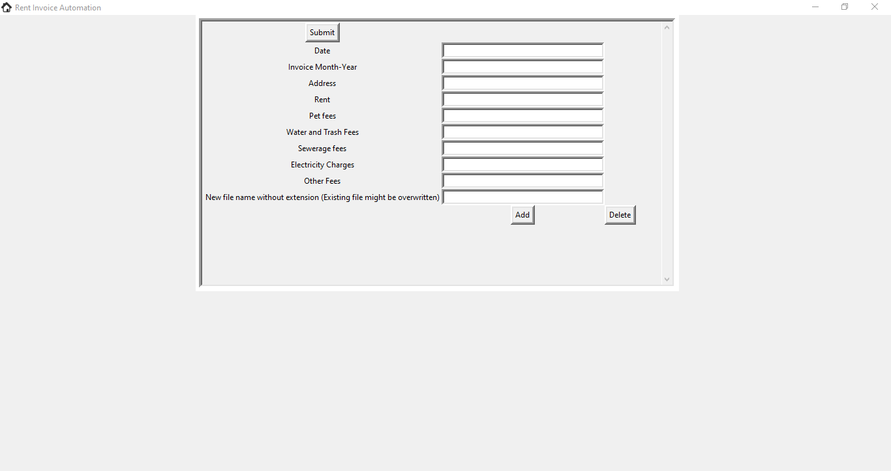
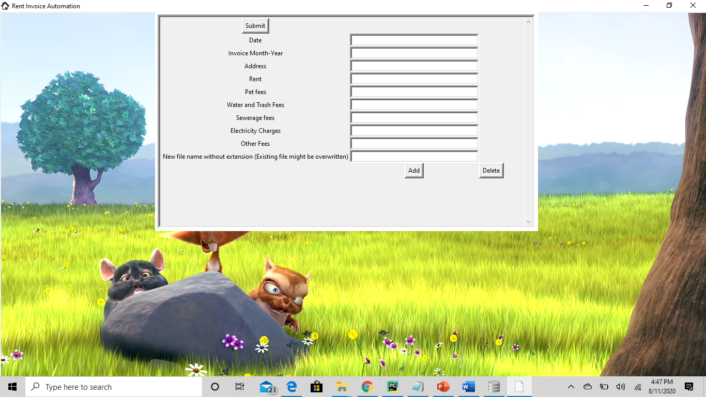
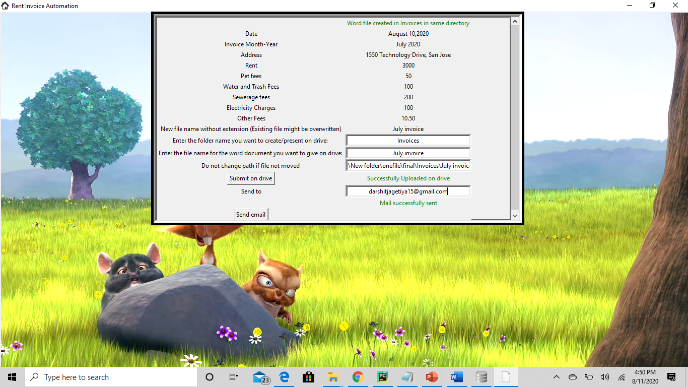
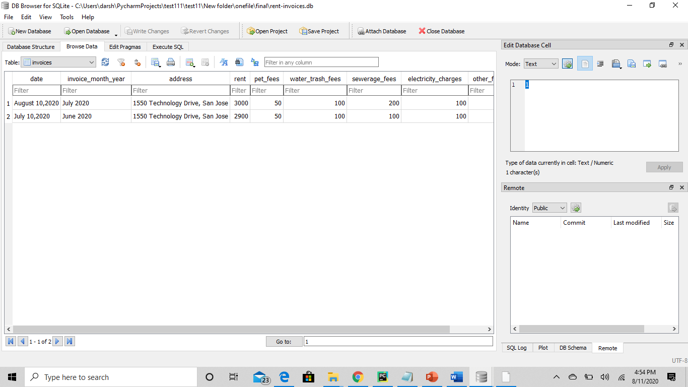

# Rent-Invoices-Automation
## Code File: Check rent-invoice.py
## Summary
This is a python program to generate monthly rent invoices in word file and upload it on google drive using rest API. 
The program uses tkinter library for the GUI, docx to create the word file, pydrive library to upload on google drive and smtp to send an email. The program is error proof and user-friendly. It is useful for all the property owners who need to generate a bill for their tenants, calculate different expenses, and then upload it on drive sharing permissions with the rental. This is a very common use as most of property owners have to do this every month and this program will help them automate their process.
## Prerequisites
* Before you continue, ensure you have installed the Python version 3.7.
## Installation
If you are running your program on cmd or tools which requires additional installation of Python libraries, here is the list of libraries that you should install to run this program.
* docx: This library add inputs into a word file in an existing one or by creating a new one. Use the command 'pip install python-docx' to install this library using your command prompt.
* PyDrive: This library is used to make changes in the google drive using rest APIs. Use the command 'pip install PyDrive' to install this library using your command prompt.
* tkinter: This library enables a GUI with which the user will interact and give inputs. Its the standars library which comes with Python installation. If you are using PyCharm, you might need to install the future module to use tkinter.
* client_secrets.json file: Put this file in the same folder as your python file if you are using PyCharm or in your current directory where the word file will be saved if you use the terminal. You can enable your own google drive API from https://developers.google.com/drive/api/v3/enable-drive-api from where you will get this json file which will provide the authorization to use APIs. However, if you do not want to upload the file on the drive then you donot need to do this step.
## Using the software
On running the program, it will open a GUI tab. It will ask to add various inputs which are required for the invoice.

The add and delete tab enables to add more variable and expenses other than the default expenses. The software is designed to throw errors if inputs are given in the other format than required. For amounts, it will only accept integers and decimals and will throw an error for alphabets or special characters.  
Once you submit, the add and delete tabs will be removed and if there are no errors then you will get an option to upload the file on drive. You can add a folder in which you want to add the file on drive and change the file name if you wish to give a different name to the file than the once you gave previously to save on your computer. The last step is to mention the path of your file on your computer and press Submit on Drive. It will open your default browser and ask you to choose the drive account if you are not already logged in to provide authorization to the software. You can upload multiple files one after the other from your computer just by mentioning the path. After you upload the file on drive, an other option will be enabled to send an email. The user will need to provide his email id, password, and the email of the tenant to send the notifying email of the invoice uploaded on the drive. 
Check the main repository to see images of various sections of the software.
## Using the app
I have created an app for the above software. Contact me on darshitjagetiya15@gmail.com if you are not a python user and just interested in using the app. 
## Glimpse of the app

